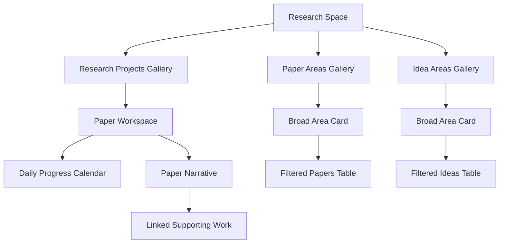

<div align="center">

# Notion Paper-First Research Space

**A paper-first research operating system for Codex and Claude Code**

[](https://learn.chatgpt.com/docs/build-skills)
[](https://code.claude.com/docs/en/skills)
[](https://www.notion.so/)
[](https://github.com/rkdrn79/notion-tracker/commits/main)

</div>

Turn Notion into the complete writing surface for a research portfolio. Each research project opens directly into a paper-shaped workspace, unsupported claims link to the work needed to resolve them, and daily progress stays connected to the manuscript rather than becoming an isolated activity log.

The goal is simple: a researcher should be able to understand the argument and draft the paper from Notion alone.

## What it builds

| Component | Behavior |
|---|---|
| Research Space | Keeps multiple independent research projects in one portfolio |
| Research Projects Gallery | Opens each project directly as a complete paper workspace |
| Paper workspace | Follows the paper from abstract through conclusion and limitations |
| Supporting work | Links claims to experiments, analyses, proofs, figures, and literature checks |
| Daily Progress | Places a project-local calendar at the top of every paper workspace |
| Paper Areas Gallery | Opens each broad research area to a filtered table of papers |
| Idea Areas Gallery | Opens each broad research area to a filtered table of ideas |
| Dynamic taxonomy | Adds a genuinely new broad area to papers and ideas without creating duplicates |
| Safe updates | Uses stable identities, read-before-write checks, and resumable reconciliation |

## Notion architecture



The Research Space root stays intentionally small: one Gallery for projects, one for paper areas, and one for idea areas. Operational metadata remains available to the agent but outside the default human reading path.

## Paper-first workflow

1. Reconstruct the research argument from authoritative project sources.
2. Write the project home in real paper order: abstract, introduction, related work, research question, method, experiments, results, discussion, limitations, and conclusion.
3. Place a supporting-work link immediately beside every statement that still needs evidence.
4. Explain each linked experiment or analysis in plain research language, including how each possible outcome would change the paper.
5. Record daily progress as changes in scientific understanding and manuscript impact.
6. Preserve uncertainty, negative results, alternative explanations, and unresolved questions.

## Research-area organization

The default broad areas are:

- World Models
- MLLM
- Generative Modeling
- Continual Learning
- Robotics
- Representation Learning
- Other

This list is extensible. The skill creates a new broad area only when it represents a research family at the same level as the existing areas. Narrow concepts such as a method, benchmark, model family, or experiment theme remain related-area tags.

When a broad area is added, the skill synchronizes all of the following:

- the Paper and Idea `Big Area` options;
- one matching card in Paper Areas and Idea Areas;
- a filtered Papers table inside the Paper Area card;
- a filtered Ideas table inside the Idea Area card;
- one deterministic stable key shared by the area pair.

## Agent compatibility

This repository follows the shared `SKILL.md` agent-skill format and can be loaded by both Codex and Claude Code.

| Agent | Project location | Personal location | Direct invocation |
|---|---|---|---|
| Codex | `.agents/skills/notion-track-research/` | `~/.agents/skills/notion-track-research/` | `$notion-track-research` |
| Claude Code | `.claude/skills/notion-track-research/` | `~/.claude/skills/notion-track-research/` | `/notion-track-research` |

Both agents can also select the skill automatically when a request matches the description in `SKILL.md`.

## Requirements

- Codex or Claude Code
- A Notion connection that allows page and database reads and writes
- Access to the project sources that contain the research outline, decisions, and reviewed results

Without a writable Notion connection, the skill returns a structured dry run and does not claim that anything was written.

## Installation

Clone the repository once into a stable location:

```bash
git clone git@github.com:rkdrn79/notion-tracker.git /absolute/path/to/notion-tracker
```

### Codex

Install for one project:

```bash
mkdir -p /absolute/path/to/project/.agents/skills
ln -s /absolute/path/to/notion-tracker /absolute/path/to/project/.agents/skills/notion-track-research
```

Or install for the current user:

```bash
mkdir -p ~/.agents/skills
ln -s /absolute/path/to/notion-tracker ~/.agents/skills/notion-track-research
```

Then mention the skill in Codex:

```text
$notion-track-research Initialize this project as a new paper workspace in my Notion Research Space.
```

Codex can also install a skill from a GitHub repository through `$skill-installer` when the repository is accessible to the current GitHub identity.

### Claude Code

Install for one project:

```bash
mkdir -p /absolute/path/to/project/.claude/skills
ln -s /absolute/path/to/notion-tracker /absolute/path/to/project/.claude/skills/notion-track-research
```

Or install for the current user:

```bash
mkdir -p ~/.claude/skills
ln -s /absolute/path/to/notion-tracker ~/.claude/skills/notion-track-research
```

Then invoke the skill directly in Claude Code:

```text
/notion-track-research Initialize this project as a new paper workspace in my Notion Research Space.
```

Claude Code watches existing skill directories for changes. If the top-level `.claude/skills` directory is created after a session starts, restart that session once.

## Example requests

Initialize or migrate a research portfolio:

```text
Use notion-track-research to create one Research Space for my current and future research projects, then migrate this project into a paper-first workspace.
```

Connect evidence to the manuscript:

```text
Use notion-track-research to explain which claim this result supports, update the relevant paper section, and link the supporting research project beside the claim.
```

Add literature and extend the taxonomy when needed:

```text
Use notion-track-research to add this paper. Assign the best broad area, and create a new broad area only if the existing taxonomy would be misleading.
```

Record manuscript-aware daily progress:

```text
Use notion-track-research to record today's progress, separating observed facts from interpretation and explaining what changed in the paper.
```

Audit writing readiness:

```text
Use notion-track-research to audit whether every paper section is writable from Notion and whether every unsupported statement has linked supporting work.
```

## Design guarantees

- Paper narrative comes before operational databases.
- Human-facing pages use research language, not server paths, job IDs, or internal code names.
- Facts, interpretations, inferences, and unmeasured claims remain distinguishable.
- Stable-key upserts prevent routine reruns from duplicating records.
- Partial failures are repaired by reconciling missing components, not deleting valid work.
- Existing human-authored content is read before any update and preserved unless the requested change requires revision.

## Repository structure

```text
.
├── SKILL.md
├── agents/
│   └── openai.yaml
└── references/
    ├── daily-progress-template.md
    ├── notion-schema.md
    ├── paper-flow-template.md
    ├── research-portfolio-template.md
    ├── research-project-page-template.md
    └── write-policy.md
```

`SKILL.md` contains the core workflow. Detailed schemas, write-safety rules, and page templates live in `references/` and are loaded only when their part of the workflow is needed.

## Validation

Run the Codex skill validator from the repository root:

```bash
python ~/.codex/skills/.system/skill-creator/scripts/quick_validate.py .
git diff --check
```

## Agent-skill documentation

- [Build skills for Codex](https://learn.chatgpt.com/docs/build-skills)
- [Extend Claude Code with skills](https://code.claude.com/docs/en/skills)
